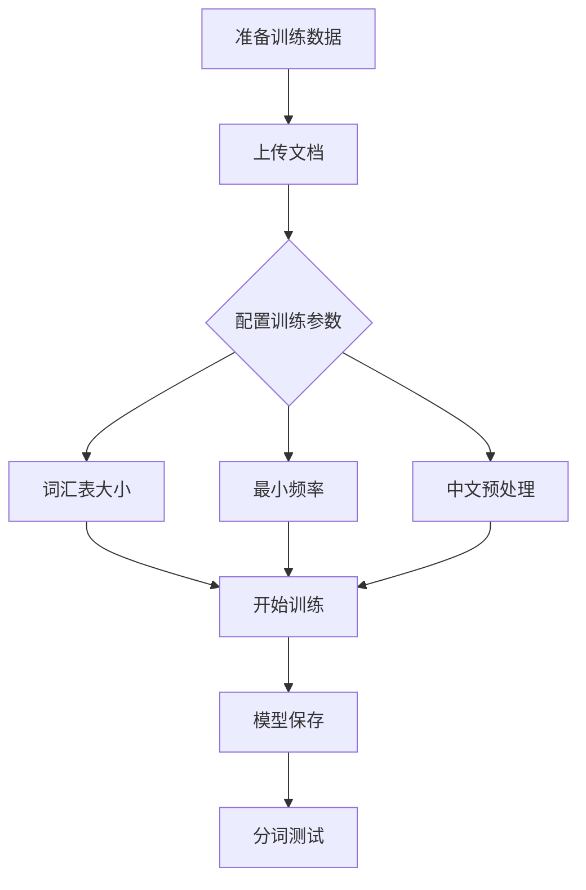

# 🧩 混合BPE中文分词器训练系统

<div align="center">


**专为中文优化的智能分词器训练工具**

[功能特性](#-功能特性) • [快速开始](#-快速开始) • [使用指南](#-使用指南) • [技术架构](#-技术架构) • [贡献指南](#-贡献指南)

</div>

## 📋 项目简介

**混合BPE中文分词器训练系统**是一个基于PyQt5的图形化中文分词器训练工具，专门优化中文文本处理，结合传统BPE算法和中文优化技术。

> **核心理念**：让中文分词训练变得简单、高效、智能

### 🎯 项目背景
- **概念提出**：张悦-玄曦雪
- **代码实现**：Deepseek AI
- **版本**：v1.0 专业版
- **许可证**：Apache-2.0

---

## ✨ 功能特性

### 🎯 核心训练功能
| 功能 | 描述 | 状态 |
|------|------|------|
| 混合BPE训练 | 结合传统BPE算法和中文优化处理 | ✅ 稳定 |
| 中文专门优化 | 智能识别和处理中文词汇 | ✅ 稳定 |
| 多格式支持 | TXT、DOCX等多种文档格式 | ✅ 稳定 |
| 自动编码检测 | UTF-8、GBK、GB2312等编码自动识别 | ✅ 稳定 |
| 图形化界面 | 直观的PyQt5图形界面 | ✅ 稳定 |

### 📊 数据处理能力
| 处理模式 | 适用场景 | 特点 |
|----------|----------|------|
| 字符级BPE | 中文文本处理 | 保持中文词汇完整性 |
| 中文预处理 | 词汇间空格处理 | 显著提升分词效果 |
| 多语言混合 | 中英文混合文本 | 智能分割不同语言 |
| 大文件支持 | 海量文本数据 | 自动分块处理 |

### 🔧 训练配置
- **词汇表控制**：灵活配置词汇表大小（5000-100000）
- **频率阈值**：设置词条最小出现频率
- **特殊Token**：支持[CLS]、[SEP]、[UNK]等特殊标记
- **进度监控**：实时训练进度和日志显示

### 🧪 测试验证
- **实时分词**：图形化测试界面
- **Token分析**：详细的分词结果和统计信息
- **性能指标**：处理速度和准确率监控

---

## 🚀 快速开始

### 系统要求
- **操作系统**：Windows 7/8/10/11, Linux, macOS 10.14+
- **Python版本**：3.8-3.11（推荐3.11）
- **内存**：4GB RAM（推荐8GB）
- **存储空间**：500MB可用空间

### 安装步骤

1. **下载项目**
```bash
git clone https://github.com/your-username/chinese-bpe-tokenizer.git
cd chinese-bpe-tokenizer
```

2. **创建虚拟环境（推荐）**
```bash
python -m venv venv
# Windows
venv\Scripts\activate
# Linux/macOS
source venv/bin/activate
```

3. **安装依赖**
```bash
# 基础依赖
pip install PyQt5 tokenizers python-docx regex

# 完整功能（推荐）
pip install -r requirements.txt
```

4. **验证安装**
```bash
python -c "import PyQt5, tokenizers, docx, regex; print('所有依赖安装成功!')"
```

5. **运行程序**
```bash
python BBPE分词器.py
```

### 可选配置
- **数据准备**：准备TXT或DOCX格式的训练数据
- **编码设置**：配置适合中文的文本编码
- **模型调优**：根据需求调整词汇表大小和训练参数

---

## 📖 使用指南

### 基础操作
1. **启动程序**：运行 `python BBPE分词器.py`
2. **上传数据**：点击"上传TXT/DOCX文档"选择训练文件
3. **配置参数**：设置词汇表大小、最小频率等参数
4. **开始训练**：点击"开始训练混合BPE分词器"
5. **测试分词**：在测试标签页输入文本验证分词效果

### 训练流程


### 参数配置指南
| 参数 | 推荐值 | 范围 | 说明 |
|------|--------|------|------|
| 词汇表大小 | 40000 | 5000-100000 | 控制模型复杂度和覆盖范围 |
| 最小频率 | 2 | 1-100 | 词条在训练集中的最小出现次数 |
| 中文预处理 | 启用 | 启用/禁用 | 显著提升中文分词效果 |
| 特殊Token | 启用 | 启用/禁用 | 添加[CLS]、[SEP]等特殊标记 |

### 快捷键列表
| 功能 | 快捷键 | 说明 |
|------|---------|------|
| 上传文档 | `Ctrl+O` | 快速选择训练文件 |
| 开始训练 | `Ctrl+T` | 启动分词器训练 |
| 切换标签 | `Ctrl+Tab` | 在训练和测试标签间切换 |
| 清空日志 | `Ctrl+L` | 清除训练日志 |

### 测试示例
```python
# 输入文本示例
输入： "三月七喜欢帕姆。Hello world! 这是一个混合中英文的测试样例。"

# 输出分词结果
分词结果（12个token）：
三月七 | 喜欢 | 帕姆 | Hello | world | 这 | 是 | 一个 | 混合 | 中英文 | 的 | 测试样例

# Token详细信息
1. '三月七'（长度：3）
2. '喜欢'（长度：2）
3. '帕姆'（长度：2）
4. 'Hello'（长度：5）
5. 'world'（长度：5）
6. '这'（长度：1）
7. '是'（长度：1）
8. '一个'（长度：2）
9. '混合'（长度：2）
10. '中英文'（长度：3）
11. '的'（长度：1）
12. '测试样例'（长度：4）
```

---

## 🏗️ 技术架构

### 系统架构
```
┌─────────────────┐    ┌──────────────────┐    ┌─────────────────┐
│   用户界面层     │    │   业务逻辑层      │    │   数据存储层     │
│                 │    │                  │    │                 │
│ • PyQt5 GUI     │◄──►│ • BPE训练引擎    │◄──►│ • 模型文件      │
│ • 训练监控       │    │ • 中文处理器     │    │ • 配置文件      │
│ • 测试界面       │    │ • 文档解析器     │    │ • 训练日志      │
└─────────────────┘    └──────────────────┘    └─────────────────┘
         │                        │                       │
         ▼                        ▼                       ▼
┌─────────────────┐    ┌──────────────────┐    ┌─────────────────┐
│   数据处理层     │    │   算法核心层      │    │   外部依赖层     │
│                 │    │                  │    │                 │
│ • 多格式解析     │    │ • 混合BPE算法    │    │ • Tokenizers    │
│ • 编码检测       │    │ • 中文优化       │    │ • python-docx   │
│ • 文本清洗       │    │ • 词汇表构建     │    │ • 正则引擎      │
└─────────────────┘    └──────────────────┘    └─────────────────┘
```

### 核心技术栈
| 组件 | 技术选型 | 用途 |
|------|----------|------|
| 图形界面 | PyQt5 | 现代化用户界面 |
| 分词核心 | HuggingFace Tokenizers | BPE算法实现 |
| 文档处理 | python-docx | Word文档解析 |
| 文本处理 | 正则表达式 | 中文文本预处理 |
| 数据序列化 | JSON | 模型配置保存 |

### 核心算法原理

#### 混合BPE算法
```python
class HybridBPEChineseTrainer:
    def __init__(self):
        self.chinese_processor = ChineseAwareProcessor()
        self.bpe_trainer = BpeTrainer()
        
    def train(self, texts, vocab_size=40000):
        # 1. 中文预处理
        processed_texts = self.chinese_processor.preprocess(texts)
        
        # 2. BPE训练
        tokenizer = self.bpe_trainer.train(
            processed_texts, 
            vocab_size=vocab_size
        )
        
        # 3. 后处理优化
        return self.optimize_for_chinese(tokenizer)
```

#### 中文优化处理
```python
class ChineseAwareProcessor:
    def preprocess(self, text):
        # 中文词汇间添加空格
        text = self.add_spaces_between_chinese_words(text)
        # 处理标点符号
        text = self.handle_punctuation(text)
        # 英文和数字处理
        text = self.process_english_and_digits(text)
        return text
```

---

## 🔧 故障排除

### 常见问题

**Q: 程序启动时报导入错误**
```bash
# 解决方案：重新安装依赖
pip install --upgrade PyQt5 tokenizers python-docx regex
```

**Q: 训练过程中内存不足**
```bash
# 解决方案
- 减少训练文件大小
- 增加系统虚拟内存
- 使用更多但更小的训练文件分批次处理
```

**Q: 中文显示乱码**
```python
# 解决方案：检查文件编码
# 程序支持自动检测，也可手动指定
supported_encodings = ['utf-8', 'gbk', 'gb2312', 'big5']
```

**Q: DOCX文件读取失败**
```bash
# 确保python-docx正确安装
pip uninstall python-docx
pip install python-docx
```

**Q: 训练进度缓慢**
- 减少词汇表大小
- 启用中文预处理优化
- 检查硬件性能

### 性能优化建议

1. **内存优化**
   ```python
   # 对于大文件，建议分块处理
   chunk_size = 10000  # 每块处理10000个字符
   ```

2. **训练参数调优**
   ```python
   optimal_config = {
       'vocab_size': 30000,      # 平衡效果和性能
       'min_frequency': 2,       # 过滤低频词
       'preprocess_chinese': True # 显著提升中文效果
   }
   ```

3. **硬件利用**
   - 确保足够RAM（8GB+推荐）
   - 使用SSD存储加速文件读写
   - 关闭其他内存密集型应用

---

## 🤝 贡献指南

我们欢迎社区贡献！请阅读以下指南：

### 开发环境设置
1. Fork本项目
2. 创建功能分支：`git checkout -b feature/AmazingFeature`
3. 提交更改：`git commit -m 'Add AmazingFeature'`
4. 推送到分支：`git push origin feature/AmazingFeature`
5. 开启Pull Request

### 代码规范
- 遵循PEP 8编码规范
- 添加适当的类型提示
- 编写清晰的文档注释
- 确保向后兼容性

## 📝 提交信息格式规范

### 标准格式
```
类型(范围): 描述

详细说明（可选）

突破性变更: 描述（如有）
```

### 类型说明
| 类型 | 说明 | 示例 |
|------|------|------|
| `feat` | 新功能 | `feat(trainer): 新增增量训练功能` |
| `fix` | 修复bug | `fix(preprocess): 修复中文空格处理错误` |
| `docs` | 文档更新 | `docs(readme): 更新安装指南` |
| `style` | 代码格式调整 | `style(ui): 调整界面布局` |
| `refactor` | 代码重构 | `refactor(core): 重构BPE训练逻辑` |
| `test` | 测试相关 | `test(tokenizer): 添加分词准确性测试` |
| `chore` | 构建工具或依赖更新 | `chore(deps): 更新tokenizers版本` |

### 范围说明
| 范围 | 说明 | 示例 |
|------|------|------|
| `trainer` | 训练器核心功能 | `feat(trainer): 支持自定义特殊token` |
| `preprocess` | 预处理功能 | `fix(preprocess): 修复编码检测逻辑` |
| `tokenizer` | 分词器功能 | `feat(tokenizer): 新增多线程分词` |
| `ui` | 用户界面 | `style(ui): 优化训练进度显示` |
| `doc` | 文档处理 | `fix(doc): 修复DOCX文件解析` |
| `test` | 测试框架 | `test(integration): 添加集成测试` |

### 突破性变更说明
当提交包含不向后兼容的变更时，必须使用`突破性变更:`部分。

#### 训练器相关
```
feat(trainer): 重构训练参数配置系统

详细说明：
- 引入新的配置类统一管理训练参数
- 支持配置文件导入导出
- 增加参数验证机制

突破性变更: 
- 训练参数配置格式完全变更
- 需要更新所有现有配置文件
- 移除了旧的参数设置方法
```

#### 分词器相关
```
refactor(tokenizer): 统一分词器接口

详细说明：
- 创建统一的分词器基类
- 支持多种分词模式
- 优化内存使用效率

突破性变更:
- 自定义分词器需要继承新的基类
- 分词接口方法签名变更
- 移除了对旧版分词器的兼容支持
```

### 提交信息最佳实践

1. **标题简洁明了**
   - ✅ `feat(trainer): 支持增量训练`
   - ❌ `在训练器中添加了增量训练的功能支持`

2. **详细说明结构化**
   - 使用Markdown格式
   - 分节描述修改内容、解决的问题
   - 包含配置示例或代码片段

3. **突破性变更明确**
   - 列出所有不兼容变更
   - 提供迁移指南
   - 标注影响范围

4. **关联Issue**
   - 在详细说明中引用相关Issue
   - 使用 `Closes #123` 或 `Fixes #456`

### 模板文件
在项目根目录创建 `.git-commit-template.txt`：

```
# 提交信息模板
# 类型: feat|fix|docs|style|refactor|test|chore
# 范围: trainer|preprocess|tokenizer|ui|doc|test

类型(范围): 一句话描述

## 详细说明
（可选，描述修改的详细内容、解决的问题等）

## 测试说明
（描述如何测试这个修改）

突破性变更: 
（如有不兼容变更，请详细说明）

关联Issue: #123, #456
```

使用模板：
```bash
git config commit.template .git-commit-template.txt
```

---

## 📄 许可证

本项目采用 **Apache License 2.0** 许可证。

**主要条款：**
- ✅ 允许商业使用
- ✅ 允许修改和分发
- ✅ 允许专利使用
- ✅ 需要保留版权声明
- ❌ 不提供责任担保

完整许可证文本请查看 [LICENSE](LICENSE) 文件。

---

## 🌟 致谢

### 特别感谢
- **张悦-玄曦雪** - 项目概念提出者和灵感来源
- **Deepseek AI** - 代码实现和技术支持
- **开源社区** - 感谢所有依赖库的维护者

### 使用的开源库
| 库名称 | 用途 | 许可证 |
|--------|------|--------|
| PyQt5 | 图形界面框架 | GPL |
| Tokenizers | BPE算法实现 | Apache 2.0 |
| python-docx | Word文档处理 | MIT |
| regex | 高级正则表达式 | Apache 2.0 |

---

## 📞 支持与反馈

如果您在使用过程中遇到问题：

1. **查看文档**：仔细阅读本文档和相关注释
2. **检查日志**：查看程序生成的日志文件
3. **提交Issue**：在GitHub Issues页面描述问题
4. **社区讨论**：参与项目讨论和交流

### 提交Issue时请提供：
- 操作系统和Python版本
- 完整的错误信息和堆栈跟踪
- 复现问题的详细步骤
- 相关截图或日志文件

---

## 🚀 发展路线图

### 近期计划
- [ ] 增量训练支持
- [ ] 更多预训练模型集成
- [ ] 批量处理功能
- [ ] 性能监控面板

### 长期愿景
- [ ] 分布式训练架构
- [ ] 在线学习能力
- [ ] 多语言扩展支持
- [ ] 云端部署方案

---

<div align="center">

## 🎉 开始使用

**混合BPE中文分词器 - 让中文文本处理变得更智能、更高效！**

[快速开始](#-快速开始) • [报告问题](https://github.com/your-username/chinese-bpe-tokenizer/issues) • [参与贡献](#-贡献指南)

*最后更新：2025年11月6日*

</div>
